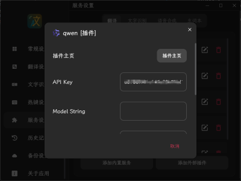
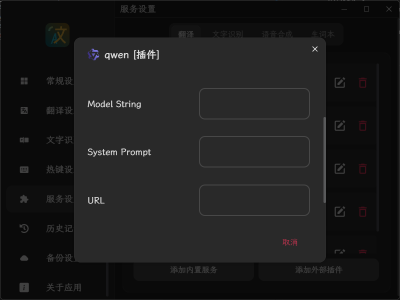

# Pot-App Qwen 翻译插件

## 介绍

- 使用了 [together.ai](https://together.ai) 的 API 接口，需要 API Key 才能使用，注册有 25$ 使用额度
- 默认选择 ***Qwen1.5-14B-Chat*** 模型，可以输入 Model String 选择其它模型，[模型列表](https://docs.together.ai/docs/inference-models)
- 默认使用翻译用 **System prompt**，可以自定义
- 如果需要自定义 temperature,top_p 等参数，参考 [API Reference](https://docs.together.ai/reference/chat-completions) 
- 默认使用的 [together.ai](https://together.ai) 提供的 [URL](https://api.together.xyz/v1/chat/completions)，可自定义

## 特点

- 得益于 Qwen 1.5 对多语言的良好表现，翻译准确、自然
- 调用API过程不需要代理，响应速度快
- 可以使用选择模型多，部分模型支持 System prompt

## 截图

